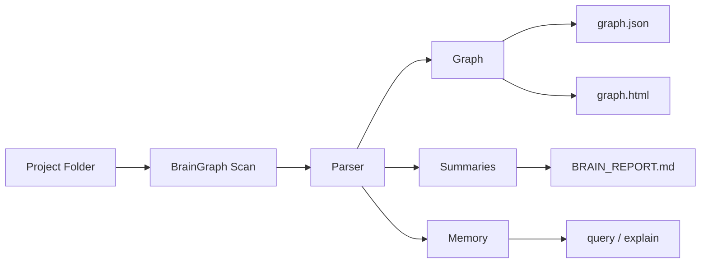
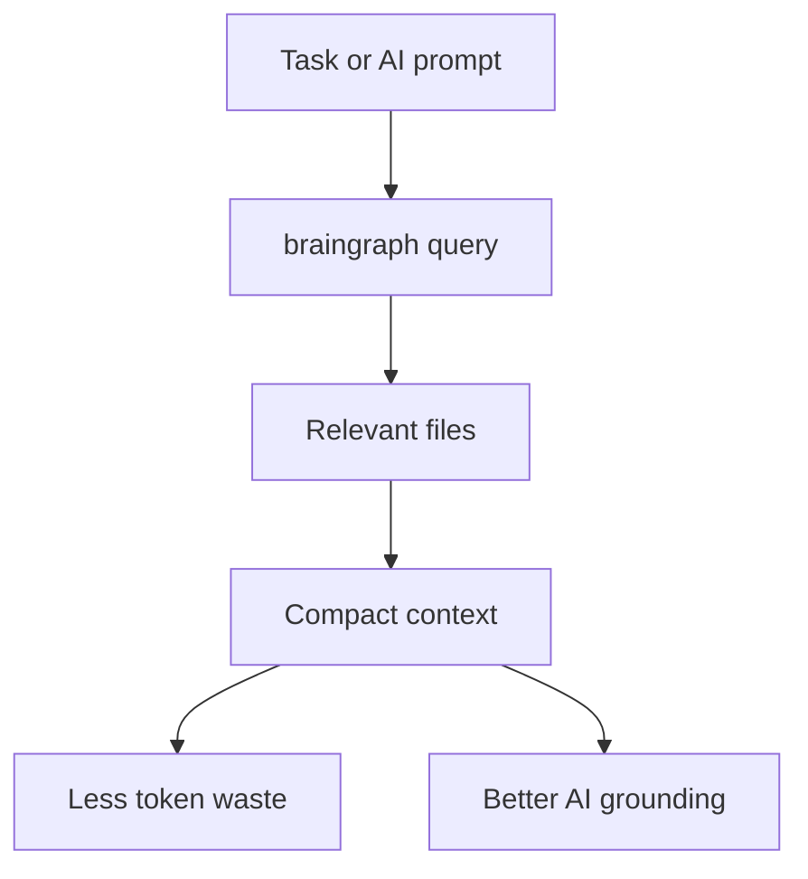

# BrainGraph

> Local-first codebase graph memory for AI-assisted development.

BrainGraph helps developers and AI coding tools understand a repository without reading everything blindly. It scans your project, builds a graph of files and relationships, stores compact memory, and returns focused context for tasks like auth flow tracing, routing analysis, dependency understanding, and system explanations.

## What BrainGraph Does

- Scans your repository locally
- Detects functions, classes, imports, routes, components, and relationships
- Builds a graph you can inspect and query
- Writes summaries and diagnostics automatically
- Gives AI tools smaller, better, more relevant context

## Visual Overview





## Step-by-Step Setup Guide

### 1. Prerequisites

Make sure Python is available in your terminal:

```bash
python --version
```

BrainGraph is designed for Python `3.12+`.

## 2. Install BrainGraph

Once BrainGraph is published, users should install it directly with pip:

```bash
python -m pip install braingraph
```

Optional vector backend:

```bash
python -m pip install "braingraph[vector]"
```

Verify installation:

```bash
braingraph --help
braingraph version
```

Upgrade later:

```bash
python -m pip install --upgrade braingraph
```

## 3. Platform-Specific Setup

BrainGraph works best when installed in the same environment your terminal or AI tool can access.

### Windows

If `python` works in terminal, then:

```bash
python -m pip install braingraph
```

### If `python` does not work

Try:

```bash
py -m pip install braingraph
```

## 4. Run BrainGraph on Your Codebase

If you are already inside your project folder:

```bash
braingraph .
```

Or explicitly initialize it:

```bash
braingraph init .
```

This generates:

```text
braingraph-out/
├── graph.json
├── graph.html
├── BRAIN_REPORT.md
├── summaries/
├── memory.db
├── embeddings.db
├── cache/
└── integrations/
```

### Run BrainGraph on another project location

```bash
braingraph "C:\Users\YourName\Desktop\MyProject"
```

### Folder path with spaces

```bash
braingraph "C:\Users\YourName\Desktop\Client Project\Frontend App"
```

## 5. Make BrainGraph Always Available to AI

BrainGraph can generate project-local instruction files for coding assistants so they use BrainGraph first before broad repo reads.

### Codex

```bash
braingraph codex install .
```

### Claude Code

```bash
braingraph claude install .
```

### Cursor

```bash
braingraph cursor install .
```

### Gemini CLI

```bash
braingraph gemini install .
```

### GitHub Copilot

```bash
braingraph copilot install .
```

### Files BrainGraph creates for AI tools

- `.codex/braingraph.md`
- `.claude/commands/brainGraph.md`
- `.cursor/rules/braingraph.mdc`
- `.gemini/commands/brainGraph.md`
- `.github/instructions/braingraph.instructions.md`

## 6. Ignore Unnecessary Files

BrainGraph already ignores common noise such as:

- `.git`
- `node_modules`
- `dist`
- `build`
- cache folders
- virtual environments
- generated BrainGraph output

That keeps scans cleaner and retrieval more useful.

## 7. Query Your Graph

After scanning, ask BrainGraph for focused context.

### Query relevant files

```bash
braingraph query "auth flow"
```

### Explain a system

```bash
braingraph explain "routing system"
```

### Show repository stats

```bash
braingraph stats
```

### Run diagnostics

```bash
braingraph doctor
```

### Export graph again

```bash
braingraph graph
```

### Refresh after changes

```bash
braingraph update .
```

### Watch a project for changes

```bash
braingraph watch . --seconds 30
```

## 8. Give Context to the Agent

This is the recommended workflow for AI tools.

Instead of:

```text
Read the full repo and explain authentication
```

Use:

```text
Run braingraph query "authentication flow" first, then use only the returned files.
```

### Good BrainGraph-first AI workflow

1. Run `braingraph query "<task>"`
2. Read only the returned files
3. Use `braingraph explain "<system>"` for compact understanding
4. Use `braingraph path "<file A>" "<file B>"` for relationship tracing
5. Re-run `braingraph update .` after major refactors

### Example prompts for AI workflows

```text
Run braingraph query "login flow" and explain the returned files.
```

```text
Use braingraph explain "routing system" before reading controllers manually.
```

```text
Run braingraph path "login.tsx" "auth.py" and explain how they are connected.
```

## 9. How to Give Project Location Explicitly

Some commands accept a project argument directly, and some use `--project`.

### Direct project path commands

```bash
braingraph "C:\Projects\MyApp"
braingraph init "C:\Projects\MyApp"
braingraph update "C:\Projects\MyApp"
braingraph watch "C:\Projects\MyApp" --seconds 20
```

### Use `--project` for query/explain/stats/doctor/graph

```bash
braingraph query "payment flow" --project "C:\Projects\MyApp"
braingraph explain "order pipeline" --project "C:\Projects\MyApp"
braingraph stats --project "C:\Projects\MyApp"
braingraph doctor --project "C:\Projects\MyApp"
```

## 10. What BrainGraph Detects

BrainGraph currently focuses on practical repo understanding:

- Python functions and classes
- JavaScript and TypeScript functions
- React-style components
- imports and dependency-like links
- route-like patterns
- duplicate files by content
- circular imports
- weak or dead files
- syntax issues in broken files

## 11. Reference Commands

```bash
braingraph install
braingraph init .
braingraph .
braingraph version
braingraph query "show auth flow"
braingraph explain "routing system"
braingraph path "login.tsx" "auth.py"
braingraph stats
braingraph graph
braingraph doctor
braingraph update .
braingraph watch . --seconds 10
braingraph clear --yes
```

## 12. Typical End-to-End Flow

```bash
python -m pip install braingraph
braingraph "C:\Users\YourName\Desktop\MyProject"
braingraph query "auth flow" --project "C:\Users\YourName\Desktop\MyProject"
braingraph explain "routing system" --project "C:\Users\YourName\Desktop\MyProject"
braingraph doctor --project "C:\Users\YourName\Desktop\MyProject"
```

## 13. Why This Helps in Real AI Work

Without BrainGraph:

- AI reads too many files
- token usage increases
- context gets noisy
- architecture understanding becomes slower

With BrainGraph:

- context is filtered
- relevant files are surfaced faster
- prompts stay smaller
- AI gets better structure before reasoning

## 14. Notes for Contributors

This section is only for contributors, not end users.

### Run tests

```bash
python -m pytest -q
```

### Local editable install

```bash
python -m venv .venv
.venv\Scripts\activate
python -m pip install -e .
python -m pip install -e ".[dev]"
```

## 15. Credits

Built and prepared by **Mohd.Kaif** with team **ClarusCodix**.

